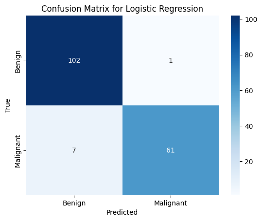
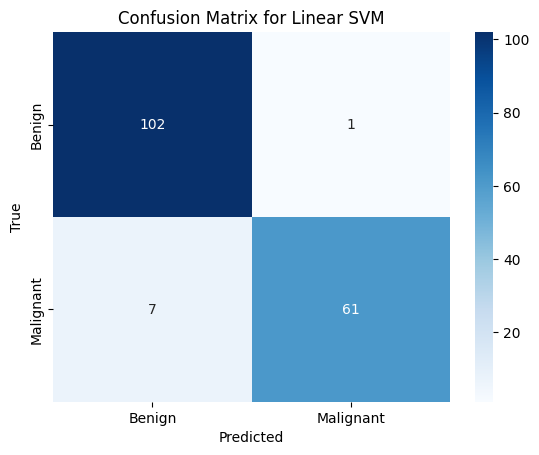
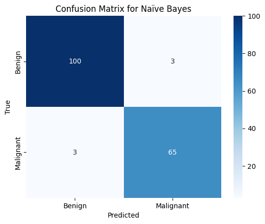
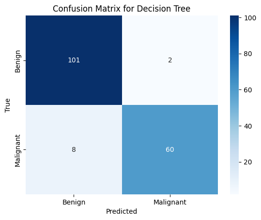
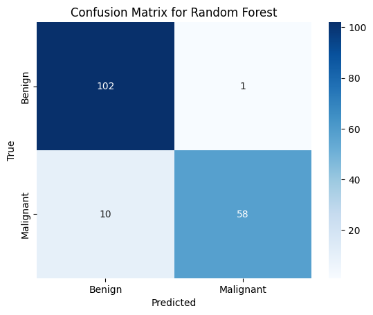

# Breast Cancer Diagnosis: A Multi-Model Machine Learning Approach

## By: Leticia Genao
## Course: N.U. ANA680

### Problem Statement
Breast cancer is a major health problem worldwide. This project applies various machine learning models to predict breast cancer using the dataset from the UCI Machine Learning Repository.The aim is to evaluate and compare the performance of several algorithms to determine the most effective model for classifying tumors as benign or malignant.

### Dataset Description
The Breast Cancer Wisconsin (Original) Dataset is utilized in this study, featuring data from 683 patients. Each instance includes 10 features related to the characteristics of the cell nuclei present in a digitized image of a fine needle aspirate (FNA) of a breast mass.

- **Data Source:** [Breast Cancer Wisconsin (Original) Dataset](  https://archive.ics.uci.edu/dataset/15/breast+cancer+wisconsin+original)
 - **Rows** 683
- **Columns** 11 (including the target variable 'Class')

## Methodology

## Data Preprocessing
Converted class labels from 2 (benign) and 4 (malignant) to 0 and 1. 
Split the dataset into training (75%) and testing (25%) sets. No additional cleaning or feature engineering was performed to maintain data integrity.

## Model Building
 Implemented the following classification models using Scikit-learn:

* Logistic Regression
* K-Nearest Neighbors (KNN)
* Support Vector Machines (SVM) - Linear and RBF kernels
* Naïve Bayes
* Decision Tree
* Random Forest
* XGBoost
  
## Model Evaluation
The models were evaluated based on their accuracy and the confusion matrix. These metrics help in understanding the models' capabilities in correctly predicting the class labels.

# Results
The following tables and figures summarize the performance of each model:
### Model Performance Summary

| Model             | Accuracy |
|-------------------|----------|
| Logistic Regression | 95.32%   |
| KNN (k=5)         | 94.73%   |
| SVM (Linear)      | 95.32%   |
| SVM (RBF)         | 94.73%   |
| Naïve Bayes       | 96.49%   |
| Decision Tree     | 94.15%   |
| Random Forest     | 93.56%   |
| XGBoost           | 95.32%   |

### Model Confusion Matrices

#### Logistic Regression Confusion Matrix

#### KNN (k=5) Confusion Matrix

#### SVM (Linear) Confusion Matrix

#### SVM (RBF) Confusion Matrix

#### Naïve Bayes Confusion Matrix

#### Decision Tree Confusion Matrix

#### Random Forest Confusion Matrix

#### Random Forest Confusion Matrix

# Discussion
The models' performances differed, with Random Forest exhibiting the lowest accuracy at 93.56% and Naïve Bayes the greatest at 96.49%. The reasons for this variation in performance may be traced back to a number of inherent aspects of how each model handles the properties of the data and how sophisticated their algorithms are.

*	**Naïve Bayes** performed well, probably because of its efficiency in binary classification tasks and its assumption of feature independence, which seemed to work well with this dataset despite the real interdependencies.
*	**XGBoost**, **SVM (Linear)**, and **Logistic Regression** all reported accuracy rates of 95.32%. The robustness of these models in drawing linear decision boundaries makes them appropriate for the dataset's apparent linear separability.
*	Given that **SVM (RBF)** and **KNN (k=5)** both have accuracy rates of 94.73%, it is possible that noise and outliers had a minor impact due to their reliance on radial basis functions and neighbor closeness, which might cause overfitting.
*	The results from **Decision Tree** and **Random Forest** were not very impressive, which could be attributed to their distinct overfitting and underfitting tendencies. Without adjustment, the decision tree's simplicity and the forest's randomness might not be able to adequately capture the dataset's complexity or patterns without overfitting to noise.

# Error Analysis
The models' sensitivity and specificity are demonstrated by the false positives and false negatives that were noted for each model. Despite their high accuracy, models such as Naïve Bayes exhibited a propensity towards increased false positives, suggesting that they may have been overly sensitive in identifying instances as malignant.

# Conclusion
This comprehensive comparison reveals which models perform better both qualitatively and statistically by examining how they manage prediction errors. For this dataset, XGBoost and Logistic Regression demonstrated a reasonable trade-off between sensitivity and specificity, making them appropriate options. The clinical cost of false positives vs false negatives, however, may influence the model selection. To further improve model accuracy and lessen potential biases, future research may investigate feature selection strategies, ensemble methods, and parameter tuning.

# Reference
* Dua, D. and Graff, C. (2019). UCI Machine Learning Repository [https://archive.ics.uci.edu/ml/datasets/breast+cancer+wisconsin+(original)Irvine, CA: University of California, School of Information and Computer Science.
